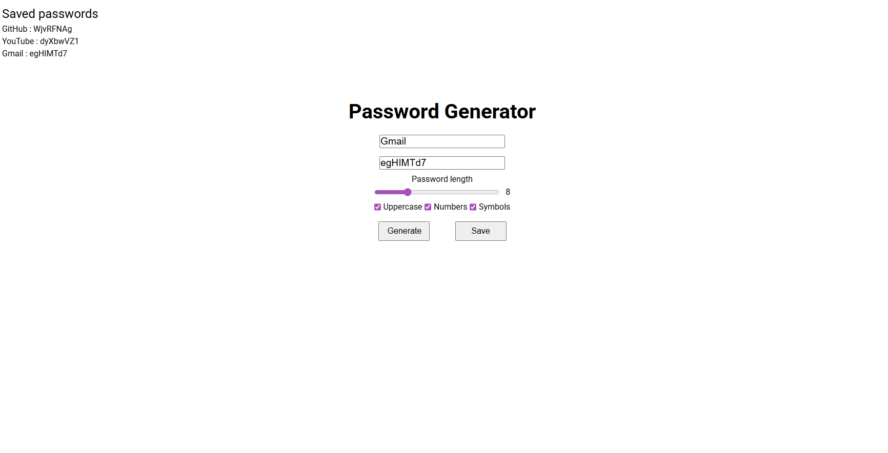

# Генератор паролей (React + Vite)

Простое веб-приложение для генерации безопасных паролей с гибкой настройкой параметров. Проект реализован с использованием React и Vite.

## Скриншоты



## Функционал

- Генерация пароля на основе выбранных параметров
- Настройка длины пароля
- Включение/отключение:
    - Заглавных букв
    - Цифр
    - Специальных символов

- Копирование пароля в буфер обмена
- Сохранение сгенерированных паролей
- Хранение данных в `localStorage`

## Использование

1. Установи зависимости:

    ```bash
    npm install
    ```

2. Запусти проект:

    ```bash
    npm run dev
    ```

3. Открой приложение в браузере (обычно `http://localhost:5173`)

4. Используй интерфейс:
    - Настрой параметры генерации
    - Нажми **Сгенерировать**
    - При необходимости:
        - **Скопировать** – копирует пароль в буфер обмена
        - **Сохранить** – добавляет пароль в список сохранённых

## Технологии

- React
- Vite
- JavaScript (ES6+)
- HTML / CSS
- localStorage API

## Особенности реализации

- Использование React hooks (`useState`, `useEffect`)
- Сохранение данных в `localStorage`
- Компонентный подход
- Разделение логики генерации и UI

---

Если хочешь, могу ещё:

- оформить README более “GitHub-профессионально” (с бейджами, версиями, демо)
- или добавить секцию структуры проекта (`src/components`, `utils` и т.д.)
- или сделать английскую версию
